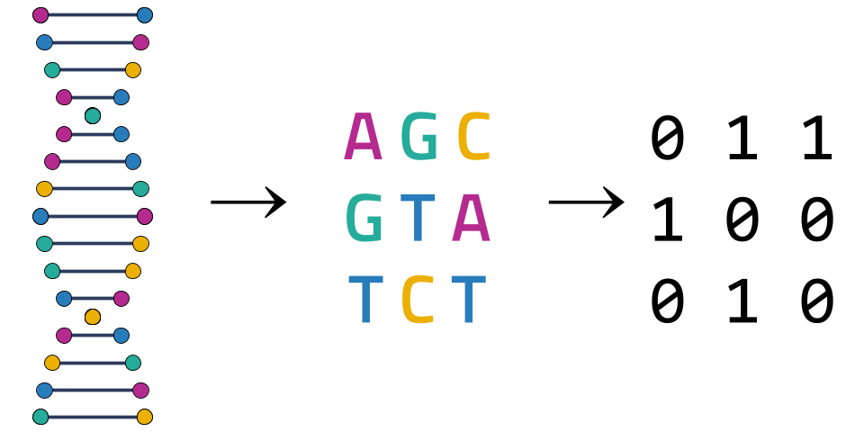

# From Bases to Bits: An Evolution of DNA Compression Algorithms
This repository contains the results of a senior capstone project conducted by Gavin Saxer, Ryan Son, and Jared Arroyo Ruiz, computer science seniors at Carleton College (2026). 

This project evaluates three distinct genomic data compression strategies to assess their efficacy in handling massive genomic datasets. We compare a general text-based approach (Huffman Coding) against two specialized DNA compressors: DNAzip (reference-based) and Biocompress 1 (non-reference-based). Our analysis aims to quantify the advantages of DNA-specialized compression over general text compression, and subsequently, to determine the benefits of employing reference-based methods within the domain of specialized genomic compression.

<div style="width:60%; margin: auto;">
  
</div>


# Data Sources and Analysis Workflow
This project performs chromosome-level comparisons between reference and target genomes to generate VCF files for downstream processing.

All target and reference genomes was sourced from the [NCBI database](https://www.ncbi.nlm.nih.gov/datasets/genome/)
- [GRCh38.p14](https://www.ncbi.nlm.nih.gov/datasets/genome/GCF_000001405.40/)
- [PAN027](https://www.ncbi.nlm.nih.gov/datasets/genome/GCA_046332005.1/)
- [ash1_v2.2](https://www.ncbi.nlm.nih.gov/datasets/genome/GCA_011064465.2/)
- [T2T-CHM13](https://www.ncbi.nlm.nih.gov/datasets/genome/GCF_009914755.1/)
- [Han1](https://www.ncbi.nlm.nih.gov/datasets/genome/GCA_024586135.1/)

The analysis pipeline relies on a small set of command-line tools:

- MUMmer4 – for whole-genome alignment
- all2vcf – for converting alignment output into VCF

Three scripts support the workflow:

- create_vcf.sh – runs chromosome-by-chromosome genome alignment and generates per-chromosome VCFs.
- merge_vcf.sh – combines multiple VCF files from one directory into a single file.
- format_vcf.sh – converts pseudo-VCF output into a simplified text format for use in DNAZip.

# Reproducing the Paper's Analysis

## Running Biocompress 1 and Huffman Coding

## Running DNAzip


## Project Directory Tree

```python
genezippers_comps/
├── alignment
│   ├── alignment.md
│   └── code
│       ├── create_vcf.sh
│       ├── format_to_vcf.sh
│       ├── merge_vcf.sh
│       └── rename_chr.sh
├── biocompress_1
│   ├── AGCT_tree.py
│   ├── biocompress.py
│   ├── compare.py
│   ├── compressor.py
│   ├── config.py
│   ├── converter.py
│   ├── data.csv
│   ├── decompressor.py
│   ├── notes.txt
│   ├── plot.py
│   ├── preprocessor.py
│   └── __pycache__
│       ├── AGCT_tree.cpython-39.pyc
│       ├── config.cpython-39.pyc
│       └── converter.cpython-39.pyc
├── clean_genomes.sh
├── dnazip
│   ├── code
│   │   ├── bitfile.py
│   │   ├── combined_plots.py
│   │   ├── constants.py
│   │   ├── dbsnp.py
│   │   ├── decode.py
│   │   ├── dels.py
│   │   ├── dnazip.py
│   │   ├── huffman.py
│   │   ├── insr.py
│   │   ├── metrics.py
│   │   ├── preprocess_dbsnp.py
│   │   ├── reader.py
│   │   └── snp.py
│   ├── data
│   │   └── variants
│   │       ├── HG002_GRCh38_sorted_variants.txt
│   │       ├── HG003_GRCh38_sorted_variants.txt
│   │       ├── HG004_GRCh38_sorted_variants.txt
│   │       └── vcf_files.zip
│   └── dnazip_setup.sh
├── download_genomes.sh
├── extract_chromosomes.sh
├── figures
│   ├── algorithm_comp.png
│   ├── ash1_genome_k_mer_plot.png
│   ├── chr21_compression_comparison.png
│   ├── genome_scaling_plot_log.png
│   ├── rm_cover.png
│   ├── storage_savings_vs_variants_plot_all.png
│   ├── storage_savings_vs_variants_plot_han1.png
│   └── time_v_storage.png
├── huffman_coding
│   └── code
│       ├── config.py
│       ├── huffman.py
│       ├── k_mer_huffman.py
│       ├── metrics.py
│       ├── plot_huffman.py
│       └── regular_huffman.py
├── process_dbsnp.sh
├── README.md
├── requirements.txt
├── run_all.sh
├── run_compression_benchmarks.sh
├── setup_env.sh
├── setup_tools.sh
└── unzip_vcf_files.sh
```
