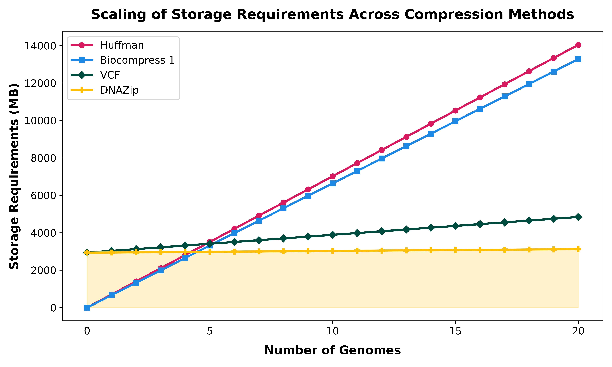

# From Bases to Bits: An Evolution of DNA Compression Algorithms
This repository contains the results of a senior capstone project conducted by Gavin Saxer, Ryan Son, and Jared Arroyo Ruiz, computer Science seniors at Carleton College (2026). 

This project evaluates three distinct genomic data compression strategies to assess their efficacy in handling massive genomic datasets. We compare a general text-based approach (Huffman Coding) against two specialized DNA compressors: DNAzip (reference-based) and Biocompress 1 (non-reference-based). Our analysis aims to quantify the advantages of DNA-specialized compression over general text compression, and subsequently, to determine the benefits of employing reference-based methods within the domain of specialized genomic compression.

<div style="width:90%; margin: auto;">

</div>


# Our Genomic Library

# Reproducing the Paper's Analysis


## Project Directory Tree

```python
comps_f25_rgj/
├── alignment
│   ├── alignment.md
│   ├── code
│   │   ├── create_vcf.sh
│   │   ├── format_to_vcf.sh
│   │   ├── merge_vcf.sh
│   │   └── rename_chr.sh
│   ├── files
│   │   ├── genomes
│   │   ├── output_ash1_v2.2
│   │   ├── output_Han1
│   │   ├── output_PAN027
│   │   └── output_T2T-CHM13
│   ├── requirements.txt
│   └── tools
│       ├── all2vcf
│       └── mummer
├── biocompress_1
│   ├── AGCT_tree.py
│   ├── biocompress.py
│   ├── compare.py
│   ├── compressor.py
│   ├── config.py
│   ├── converter.py
│   ├── data
│   ├── data.csv
│   ├── decompressor.py
│   ├── plot.py
│   └── preprocessor.py
├── dnazip
│   ├── code
│   │   ├── bitfile.py
│   │   ├── constants.py
│   │   ├── dbsnp.py
│   │   ├── decode.py
│   │   ├── dels.py
│   │   ├── dnazip.py
│   │   ├── huffman.py
│   │   ├── insr.py
│   │   ├── metrics.py
│   │   ├── plot_2.py
│   │   ├── plot.py
│   │   ├── preprocess_dbsnp.py
│   │   ├── reader.py
│   │   └── snp.py
│   ├── data
│   │   ├── chr
│   │   ├── dbSNP
│   │   ├── figures
│   │   ├── huffman_trees
│   │   ├── output
│   │   ├── variants
│   │   └── vcf
│   ├── dnazip_setup.sh
│   ├── figures
│   └── tools
│       └── bigBedToBed
├── figures
├── huffman_coding
│   ├── code
│   │   ├── config.py
│   │   ├── huffman.py
│   │   ├── k_mer_huffman.py
│   │   ├── metrics.py
│   │   ├── plot_huffman.py
│   │   └── regular_huffman.py
│   ├── output
│   │   ├── csv
│   │   ├── data
│   │   └── plots
└── README.md
```
